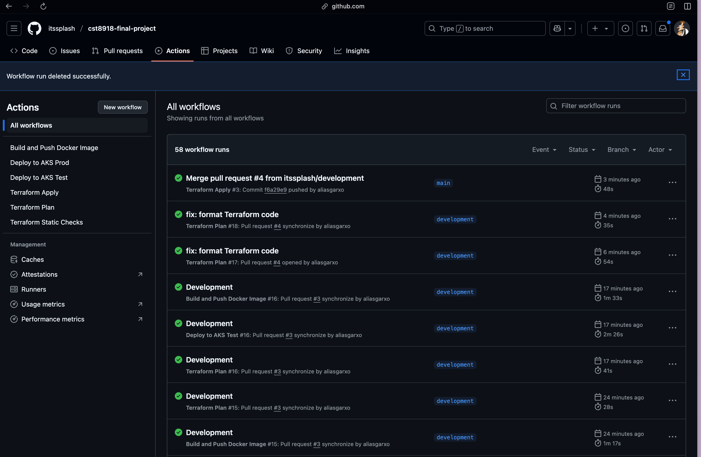

# CST8918 Final Project – Remix Weather App on Azure ☁️

## 🧠 Team Members - FP10

- Aliasgar Husain – [@aliasgarxo](https://github.com/aliasgarxo)
- Abhinav – [@itssplash](https://github.com/itssplash)
- OseenAlbert Marcelino – [@OseenMarcelino](https://github.com/OseenMarcelino)
- Devgiri Gosai - [@devgiri-code](https://github.com/devgiri-code)

## 📁 Project Structure

```
/terraform                → Infrastructure as Code (AKS, Redis, ACR, Networking)
/remix-weather-app       → Full Remix frontend app (Dockerized)
/k8s-app-deployment      → Kubernetes YAMLs (Deployment + Service)
/.github/workflows       → CI/CD workflows (Terraform, Docker, AKS deploy)
```

### Successfully running all the workflows



## 🚀 How to Set Up the Project from Scratch

### Step 1 – Create Terraform Backend (manually, once)
```bash
RESOURCE_GROUP_NAME="cst8918-final-project"
STORAGE_ACCOUNT_NAME="cst8918storagegroupfp10"  # must be globally unique
CONTAINER_NAME="tfstate"

az group create --name $RESOURCE_GROUP_NAME --location "Canada Central"

az storage account create \
  --name $STORAGE_ACCOUNT_NAME \
  --resource-group $RESOURCE_GROUP_NAME \
  --location "Canada Central" \
  --sku Standard_LRS \
  --encryption-services blob

az storage container create \
  --name $CONTAINER_NAME \
  --account-name $STORAGE_ACCOUNT_NAME
```

This backend is used to store `terraform.tfstate` remotely and securely.

### Step 2 – Clone the Project
```bash
git clone https://github.com/itssplash/cst8918-final-project.git
cd cst8918-final-project
```

### Step 3 – Configure GitHub Secrets (Required for CI/CD)
In GitHub → Settings → Secrets → Actions → Add the following:

- `AZURE_CLIENT_ID`
- `AZURE_TENANT_ID`
- `AZURE_SUBSCRIPTION_ID`
- `AZURE_RESOURCE_GROUP` = `cst8918-final-project`
- `AZURE_ACR_NAME` = `cst8918acrgroupfp10`
- `AKS_CLUSTER_TEST` = `aks-test`
- `AKS_CLUSTER_PROD` = `aks-prod`

### Step 4 – Deploy Infrastructure with Terraform
```bash
cd terraform
terraform init
terraform plan -var-file="terraform.tfvars"
terraform apply -var-file="terraform.tfvars"
```

This will create:
- VNet with 4 subnets
- AKS clusters (test and prod)
- Azure Container Registry
- Redis (Basic tier)

### Step 5 – Create Kubernetes Secrets for App
```bash
kubectl create secret generic remix-weather-secret \
  --from-literal=REDIS_URL="<your-redis-url>" \
  --from-literal=WEATHER_API_KEY="<weather-api>"
```
> Repeat this for both `aks-test` and `aks-prod` clusters.

### Step 6 – Deploy App Manually (or via GitHub Actions)
```bash
kubectl apply -f k8s-app-deployment/deployment.yaml
kubectl apply -f k8s-app-deployment/service.yaml
kubectl get svc remix-weather-service
```

Access the LoadBalancer IP to view the app in the browser.

## ✅ GitHub Actions Workflows

- `terraform-check.yml`: Static checks on push (fmt, validate, tfsec)
- `terraform-plan.yml`: Plan infra on PR to main
- `terraform-apply.yml`: Apply infra on push to main
- `docker-build.yml`: Builds Docker image on app change (PR)
- `deploy-test.yml`: Deploys to AKS test on PR
- `deploy-prod.yml`: Deploys to AKS prod on push to main

## 🔒 Branch Protection Rules

- `main` branch is protected:
  - ✅ Requires PR approval (no self-approval)
  - ✅ Requires status checks to pass
  - ✅ Requires up-to-date branches
  - ✅ Prevents direct push

## 📌 Testing Notes for Instructors

- All infrastructure is deployed to `canadacentral`
- LoadBalancer service exposes the Remix app publicly on AKS
- GitHub workflows demonstrate full CI/CD pipeline from IaC to app delivery
- Manual `kubectl` access is available via:
  ```bash
  az aks get-credentials --resource-group cst8918-final-project --name aks-test
  kubectl get all
  ```
- Docker images are pushed to Azure Container Registry
- All env secrets are handled via GitHub or Kubernetes Secrets

---

This project demonstrates DevOps best practices with IaC, GitHub Actions, Azure, and secure cloud-native app delivery. 💡

